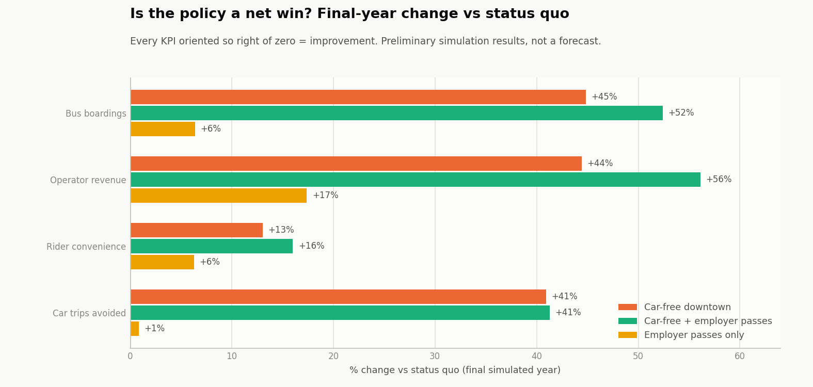
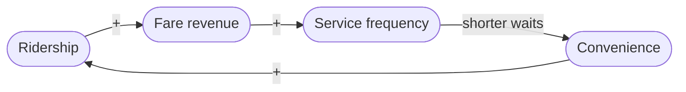
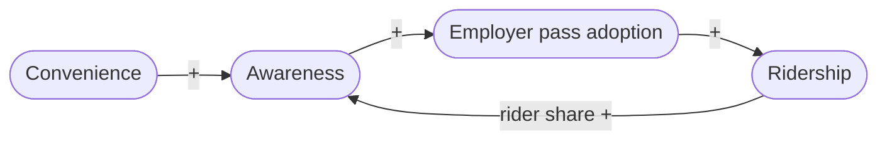

# Baltimore Car-Free City: Agent-Based Bus Ridership Model

An agent-based complex-systems model, written in Python, that simulates Baltimore
bus ridership under a hypothetical car-free downtown policy for a Johns Hopkins Research Initiative Proposal.


## Test results (20,000 agents, 5-year horizon, seed 7)

| Scenario | Annual boardings (final yr) | Annual operator revenue | vs status quo |
|---|---:|---:|---:|
| Status quo | 88.5 M | $155.9 M | — |
| Car-free downtown | 128.1 M | $225.2 M | +45% boardings |
| Car-free + employer passes | 134.8 M | $243.5 M | +52% boardings |
| Employer passes only | 94.1 M | $183.1 M | +6% boardings |

At the default 35% bulk discount, the employer-pass program adds **+5.2%
boardings** on top of the car-free baseline. The bulk-discount sweep (dashboard,
bottom-right panel) exposes the operator's tradeoff:

| Bulk discount | Ridership lift vs car-free | Revenue vs car-free | Riders holding a pass |
|---:|---:|---:|---:|
| 0% | +3.5% | +14.6% | 11% |
| 35% | +5.2% | +8.1% | 20% |
| 50% | +5.3% | +0.5% | 22% |
| 80% | +3.8% | −18.4% | 24% |

Deeper discounts recruit more employers (and more riders) but dilute revenue per
boarding; past ~50% the revenue loss feeds back through the service loop. The
operator cuts frequency, convenience falls, and the ridership lift itself starts
to shrink. 

### So is it a net win? (preliminary)



## How the model works

### Agents

Each agent represents ~32 real travelers (scale calibrated, see below) and is
drawn once with: employer attachment, car access (anchored to Baltimore's ~30%
car-free household share), downtown vs non-downtown workplace, value of time
(lognormal, ≈ $15/hr mean), access/in-vehicle/car/walk-bike travel times, a pass
enrollment propensity, and an evolving **riding habit**.

Each day, agent $i$ makes a trip with base probability $p_0$ scaled by
calibrated month-of-year and day-of-week factors. Travelers then pick
bus / car / other via a **multinomial logit** over generalized round-trip cost
(dollars; times in minutes). The bus utility is

$$U^{bus}_{i,t} = \beta_{bus} + \eta h_{i,t} - \theta\Big(F_{i} + v_i \cdot 2\big(w_i + \tfrac{30}{f_t} + T^{bus}_i\gamma_t\big)\Big)$$

where $F_i$ is the day fare (4.40 dollars; 0 with an employer pass), $v_i$ the
agent's value of time, $w_i$ access walk, $30/f_t$ the expected wait at
frequency $f_t$ buses/hr (half the headway), $T^{bus}_i$ in-vehicle time,
$\gamma_t$ the crowding multiplier, and $\theta$ the cost sensitivity. Car and
walk/bike are priced the same way. The mode is drawn from the
softmax $P(m) = e^{U_m}/\sum_k e^{U_k}$ with one uniform per agent. Riding
builds **habit** with a ~20-day memory, $h \leftarrow h + \lambda(\text{rode} -
h)$ with $\lambda = 0.05$, which feeds back into tomorrow's $U^{bus}$. 

### Causal loops (Broader systems dynamics)

| Loop | Path |
|---|---|
| **R1** reinforcing | ridership → fare revenue → service frequency → shorter waits → convenience → ridership |
| **R2** reinforcing | convenience & rider share → awareness → employer pass adoption → ridership |
| **B1** balancing | ridership → crowding → longer in-vehicle time, lower convenience → ridership |
| **B2** balancing | employer passes → discounted bulk revenue → lower farebox recovery → service pressure |

**R1 — the farebox flywheel** (reinforcing)



**R2 — awareness & word-of-mouth** (reinforcing)



**B1 — crowding** (balancing)


**B2 — pass-revenue dilution** (balancing)


## Calibration against Maryland MTA data

`datasets/ridership_data.csv` holds observed MDOT MTA monthly bus boardings,
Jan 2019 – Dec 2024. We then fit `python -m carfree calibrate` to the pre-COVID 2019 data. We choose 3 metrics:

1. seasonal factors: month-of-year demand multipliers extracted from the
   observed series (daily-mean normalized)
2. `asc_bus`: bisection until simulated bus mode share hits the ~20% target
   consistent with Baltimore transit commute shares
3. `persons_per_agent`: closed-form level scale (fitted: 1 agent ≈ 32.2
   travelers)

The calibrated baseline reproduces observed 2019 monthly boardings with
**MAPE 1.33%** (worst month −3.9%):


## Performance: profiling, vectorizing, and making it memory-lean

* `engine.py` the production path runs as ~20 NumPy array
  operations over the whole population, and only per-day aggregates are recorded
  (no redundant state copies).

Hot paths were identified with `cProfile`: >84% of naive runtime sits in the
per-agent `step_agents` loop, which is exactly what got vectorized.


Measured on this machine (`python -m carfree benchmark`), the vectorized engine is
14–23× faster and uses ~45–50× less peak memory, with the gap widening as the
population grows (the original optimization target of ~4× came from vectorizing
the mode-choice inner loop alone).

## Quickstart

Requires Python 3.10+.

```bash
git clone <repo-url> && cd car-free-city
pip install -r requirements.txt        # numpy, pandas, matplotlib
pip install -r requirements-dev.txt    # + pytest, line_profiler (optional)

python -m carfree calibrate            # fit to MTA 2019 data -> outputs/calibration.json
python -m carfree validate             # divergence check vs observed (exit code for CI)
python -m carfree dashboard            # scenario suite + sweep -> outputs/dashboard.png/.html
python -m carfree run --scenario car_free_passes --years 5   # single run, KPIs to stdout
python -m carfree sweep --values 0,0.2,0.35,0.5,0.65,0.8     # tradeoff CSV
python -m carfree benchmark --city-scale --plot outputs/benchmark.png
python tools/profile_hotpaths.py       # cProfile + line_profiler hot paths
python -m pytest tests -q              # 19 tests
```

## Repository layout

```
carfree/
  params.py         model parameters + scenario presets (dataclasses)
  population.py     synthetic population (struct-of-arrays, fixed draw order)
  employers.py      stochastic employer pass adoption + enrollment
  dynamics.py       shared causal-loop formulas (service, convenience, awareness)
  engine_common.py  simulation scaffold: calendar, burn-in anchoring, recording
  engine.py         vectorized engine (production path) + simulate() facade
  engine_naive.py   per-agent reference engine (benchmark "before", ground truth)
  results.py        SimulationResult: daily/monthly frames + KPIs
  calibration.py    fit to observed MTA data -> calibration.json
  validation.py     automated divergence flagging (PASS/WARN/FAIL + JSON report)
  dashboard.py      scenario suite, discount sweep, PNG + HTML dashboard
  benchmark.py      naive-vs-vectorized runtime & peak-memory measurement
  cli.py            python -m carfree {run,calibrate,validate,dashboard,sweep,benchmark}
tools/              profile_hotpaths.py, benchmark.py wrappers
tests/              engine equivalence, behavioral invariants, validation flagger
datasets/           observed MDOT MTA monthly ridership (2019-2024)
docs/img/           dashboard, calibration, benchmark figures used above
```

## Data & parameter sources

* **Ridership**: MDOT MTA monthly bus boardings 2019–2024
  (`datasets/ridership_data.csv`; `new_ridership_data.csv` is the core
  local-bus subset) — see the MTA's [performance & ridership reporting](https://www.mta.maryland.gov/performance-improvement).
* **Fares**: $2.00 one-way / $4.40 day pass (the model's effective per-rider-day
  fare) / ~$74 monthly pass -- [MDOT MTA fare tariff](https://www.mta.maryland.gov/fare-tariff-policy),
  [fare history](https://www.cbsnews.com/baltimore/news/mta-fare-raise-june).
* **Car access**: ~30% of Baltimore City households have no vehicle available —
  [ACS via BNIA / Open Baltimore](https://data.baltimorecity.gov/datasets/bniajfi::percent-of-households-with-no-vehicle-available-city/about);
  person-level car access is set higher (62%) since commuters skew toward access.
* **Behavioral anchors**: ~$15/hr mean value of time, ~20% baseline transit share
  of daily travelers, 25% farebox recovery target, 0.75 target load factor.
  divestment dynamics under the ban, income-stratified fare policy, Metro/Light
  Rail interaction.

## License

MIT — see [LICENSE](LICENSE).
