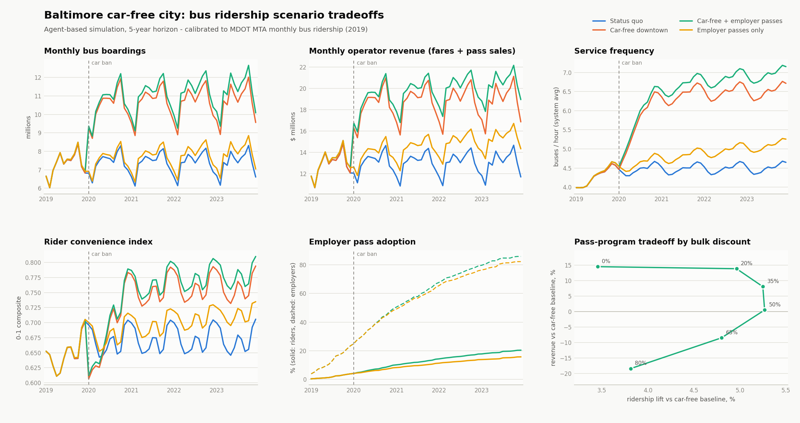
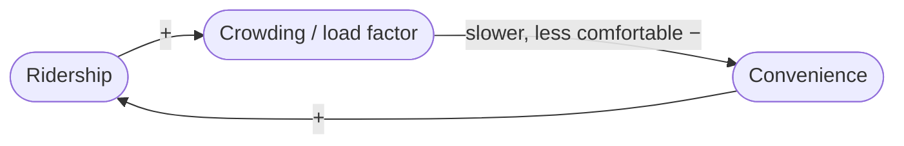
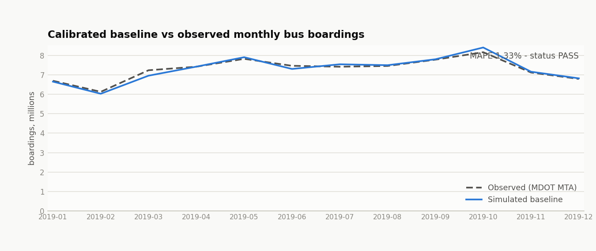
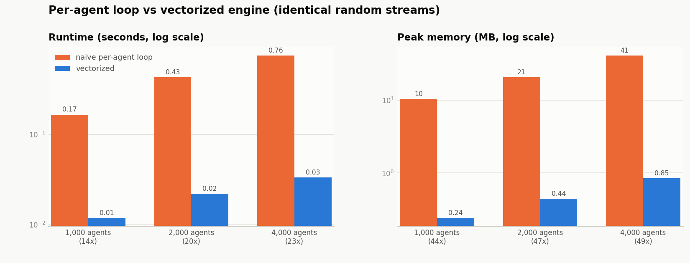

# Baltimore Car-Free City: Agent-Based Bus Ridership Model

An agent-based complex-systems model, written in Python, that simulates Baltimore
bus ridership under a hypothetical **car-free downtown policy**. Tens of thousands
of synthetic commuters make daily mode choices inside a feedback system connecting
**ridership, fare revenue, service frequency, and rider convenience**, with
**employer transit-pass adoption** modeled as a stochastic behavioral process. The
model is calibrated against observed **Maryland MTA monthly ridership**, ships with
an automated divergence monitor, and renders a scenario-tradeoffs dashboard for
stakeholders.



## Test results (20,000 agents, 5-year horizon, seed 7)

| Scenario | Annual boardings (final yr) | Annual operator revenue | vs status quo |
|---|---:|---:|---:|
| Status quo | 88.5 M | $155.9 M | — |
| Car-free downtown | 128.1 M | $225.2 M | +45% boardings |
| Car-free + employer passes | 134.8 M | $243.5 M | +52% boardings |
| Employer passes only | 94.1 M | $183.1 M | +6% boardings |

At the default 35% bulk discount, the employer-pass program adds **+5.2%
boardings** on top of the car-free baseline. The bulk-discount sweep (dashboard,
bottom-right panel) exposes the operator's tradeoff:

| Bulk discount | Ridership lift vs car-free | Revenue vs car-free | Riders holding a pass |
|---:|---:|---:|---:|
| 0% | +3.5% | +14.6% | 11% |
| 35% | +5.2% | +8.1% | 20% |
| 50% | +5.3% | +0.5% | 22% |
| 80% | +3.8% | −18.4% | 24% |

Deeper discounts recruit more employers (and more riders) but dilute revenue per
boarding; past ~50% the revenue loss feeds back through the service loop. The
operator cuts frequency, convenience falls, and the ridership lift itself starts
to shrink. 

## How the model works

### Agents

Each agent represents ~32 real travelers (scale calibrated, see below) and is
drawn once with: employer attachment, car access (anchored to Baltimore's ~30%
car-free household share), downtown vs non-downtown workplace, value of time
(lognormal, ≈ $15/hr mean), access/in-vehicle/car/walk-bike travel times, a pass
enrollment propensity, and an evolving **riding habit**.

Each day, agent $i$ makes a trip with probability

$$P^{travel}_t = \min\big(p_0 \sigma_{m(t)} \delta_{d(t)},\ 0.98\big)$$

where $\sigma_m$ are calibrated month-of-year factors and $\delta_d$ day-of-week
factors. Travelers then pick bus / car / other via a **multinomial logit** over
generalized round-trip cost — costs in dollars, times in minutes, where $v_i$ is
the agent's value of time in dollars per minute and $\theta$ the cost
sensitivity:

$$U^{bus}_{i,t} = \beta_{bus} + \eta h_{i,t} - \theta\Big(F_{i} + v_i \cdot 2\big(w_i + \tfrac{30}{f_t} + T^{bus}_i\gamma_t\big)\Big)$$

$$U^{car}_{i} = -\theta\Big(P_i + (c + v_i)\cdot 2 T^{car}_i\Big) \quad\big(= -\infty \text{ if carless, or downtown worker under the ban}\big)$$

$$U^{other}_{i} = \beta_{other} - \theta v_i \cdot 2 T^{other}_i \qquad\qquad P(m) = \frac{e^{U_m}}{\sum_k e^{U_k}}$$

Here $F_i$ is the day fare (4.40 dollars, or 0 with an employer pass), $w_i$ access
walk, $30/f_t$ the expected wait at frequency $f_t$ buses/hr (half the headway),
$\gamma_t$ the crowding multiplier, $P_i$ parking, and $c$ per-minute car
operating cost. One uniform draw per agent selects the mode by inverse CDF.
Riding builds **habit** with a ~20-day memory,

$$h_{i,t+1} = h_{i,t} + \lambda(\mathbb{1}[\text{rode}_{i,t}] - h_{i,t}),\qquad \lambda = 0.05,$$

which feeds back into tomorrow's $U^{bus}$ — the micro-level path dependence
that makes policy shocks persistent.

### Causal loops (Broader systems dynamics)

| Loop | Path |
|---|---|
| **R1** reinforcing | ridership → fare revenue → service frequency → shorter waits → convenience → ridership |
| **R2** reinforcing | convenience & rider share → awareness → employer pass adoption → ridership |
| **B1** balancing | ridership → crowding → longer in-vehicle time, lower convenience → ridership |
| **B2** balancing | employer passes → discounted bulk revenue → lower farebox recovery → service pressure |

**R1 — the farebox flywheel** (reinforcing)


**R2 — awareness & word-of-mouth** (reinforcing)


**B1 — crowding** (balancing)



**B2 — pass-revenue dilution** (balancing)


The aggregate side closes the loops. With daily boardings
$B_t = 2(1+\tau)\cdot\text{riders}_t$ (round trip plus transfer rate $\tau$):

$$\ell_t = \frac{B_t}{\kappa f_t} \qquad \gamma_t = 1 + 0.25\max(0,\ \ell_{t-1}-1) \qquad \text{(load factor; crowding, loop B1)}$$

$$C_t = 0.45 e^{-\text{wait}_t/12} + 0.35\big(1 - \text{clip}\big(\tfrac{\ell_t-0.8}{0.7}\big)\big) + 0.20\min\big(\tfrac{f_t}{10},1\big) \qquad \text{(convenience index)}$$

$$A_{t+1} = A_t + \mu\Big(0.5 C_t + 0.5\min\big(1,\tfrac{s_t}{s^{\ast}}\big) - A_t\Big) \qquad \text{(awareness stock, loop R2)}$$

where $s_t$ is the day's rider share. Monthly, the operator moves system
frequency from the farebox-recovery gap and the load gap (loops R1/B2):

$$f \leftarrow \text{clip}\big(f(1+g),\ f_{\min},\ f_{\max}\big),\qquad g = \text{clip}\Big(k_r\tfrac{R-R^{\ast}}{R^{\ast}} + k_\ell(\bar\ell - L^{\ast}),\ \pm 5\%\Big)$$

with recovery $R$ = monthly revenue / ($f\times$ unit operating cost). The
capacity coefficient $\kappa$ and unit cost are **anchored at the end of a
90-day burn-in** so that the baseline sits exactly at $L^{\ast}=0.75$ and
$R^{\ast}=0.25$ — the service loop is neutral until a policy actually shocks the
system, so scenario differences are caused, not drifted.

### Employer transit passes (stochastic mechanism)

Each month, every employer that doesn't yet offer passes adopts with hazard

$$P(\text{adopt}) = h_0 (1 + g_a A)(1 + g_p \cdot \text{offer share})(0.4 + 1.7\delta) \quad \text{capped at } 0.10/\text{mo}$$

the compounding of word-of-mouth ($A$), peer imitation, and program price
(bulk discount $\delta$) is what produces the S-curve adoption visible in the
dashboard. An employee of an offering firm enrolls (monotonically, once) when
their static propensity draw $u_i \sim U(0,1)$ clears a habit-scaled cutoff:

$$u_i < e_0 (0.5 + 0.5A)(0.25 + 0.75 h_{i,t})$$

so enrollees skew toward existing riders — people sign up for a benefit they
expect to use. Pass holders ride fare-free while the employer pays the operator
$74(1-\delta)$ dollars per enrollee-month, so operator revenue (in dollars) is

$$\text{Rev}_{month} = \underbrace{\textstyle\sum_t \text{paying riders}_t \times 4.40}_{\text{farebox}} + \underbrace{N^{pass} \times 74(1-\delta)}_{\text{bulk pass sales}}$$

The program therefore mostly *replaces* farebox revenue with discounted bulk
revenue — the dilution loop B2 propagates — while the 0.25 enrollment floor
still converts some occasional riders into new ridership.

### Policy lever

`car_free` scenarios ban car commuting for agents working in the downtown zone
from a configurable start day; affected agents re-solve their mode choice, and the
demand shock propagates through R1/B1.

### Design notes

* **Struct-of-arrays agents.** The population is one NumPy array per attribute,
  not agent objects — the layout that lets the daily update run as whole-array
  operations.
* **Two engines, one random stream.** A naive per-agent reference engine and the
  vectorized engine draw randomness in an identical fixed order (population →
  two n-sized uniforms/day → one E-sized uniform/month-end), so same seed ⇒
  statistically identical trajectories; the tests verify it.
* **Common random numbers across scenarios.** Adoption uniforms are drawn even
  when the program is off, so scenarios share streams and their *differences*
  are low-variance.
* **Utilities price wait and crowding directly**; the convenience index $C_t$ is
  reporting + awareness only — no double counting.

## Calibration against Maryland MTA data

`datasets/ridership_data.csv` holds observed MDOT MTA monthly bus boardings,
Jan 2019 – Dec 2024. `python -m carfree calibrate` fits, on the pre-COVID 2019
window:

1. **seasonal factors**: month-of-year demand multipliers extracted from the
   observed series (daily-mean normalized);
2. **`asc_bus`**: bisection until simulated bus mode share hits the ~20% target
   consistent with Baltimore transit commute shares;
3. **`persons_per_agent`**: closed-form level scale (fitted: 1 agent ≈ 32.2
   travelers).

The calibrated baseline reproduces observed 2019 monthly boardings with
**MAPE 1.33%** (worst month −3.9%):



### Automated divergence flagging

`python -m carfree validate` re-runs the calibrated baseline and compares monthly
totals against the observed series with three checks — per-month deviation
(>10% flags), window MAPE (>8% fails), and a **rolling 3-month signed drift**
detector (>6% flags systematic bias that per-month checks miss). It prints a
month-by-month table, writes `outputs/validation_report.json`, and returns a
CI-friendly exit code (`--strict` escalates warnings), so it works both as a
regression gate for model changes and as a drift monitor when new observed months
are appended. The test suite proves the flagger fires on shifted data and stays
quiet on the fit.

## Performance: profiled, vectorized, memory-lean

* `engine.py` the production path: the per-agent update runs as ~20 NumPy array
  operations over the whole population, and only per-day aggregates are recorded
  (no redundant state copies).

Hot paths were identified with `cProfile` and `line_profiler`
(`python tools/profile_hotpaths.py`): >84% of naive runtime sits in the
per-agent `step_agents` loop, which is exactly what got vectorized.



Measured on this machine (`python -m carfree benchmark`), the vectorized engine is
**14–23× faster and uses ~45–50× less peak memory**, with the gap widening as the
population grows (the original optimization target of ~4× came from vectorizing
the mode-choice inner loop alone; eliminating the per-day state copies compounds
it). That headroom is what makes **multi-year, city-scale runs practical: 150,000
agents × 5 years completes in ~19 s** (`--city-scale`).

## Quickstart

Requires Python 3.10+.

```bash
git clone <repo-url> && cd car-free-city
pip install -r requirements.txt        # numpy, pandas, matplotlib
pip install -r requirements-dev.txt    # + pytest, line_profiler (optional)

python -m carfree calibrate            # fit to MTA 2019 data -> outputs/calibration.json
python -m carfree validate             # divergence check vs observed (exit code for CI)
python -m carfree dashboard            # scenario suite + sweep -> outputs/dashboard.png/.html
python -m carfree run --scenario car_free_passes --years 5   # single run, KPIs to stdout
python -m carfree sweep --values 0,0.2,0.35,0.5,0.65,0.8     # tradeoff CSV
python -m carfree benchmark --city-scale --plot outputs/benchmark.png
python tools/profile_hotpaths.py       # cProfile + line_profiler hot paths
python -m pytest tests -q              # 19 tests
```

Every run is deterministic given `--seed`; scenarios share random streams
(common random numbers), so scenario deltas are low-variance.

## Repository layout

```
carfree/
  params.py         model parameters + scenario presets (dataclasses)
  population.py     synthetic population (struct-of-arrays, fixed draw order)
  employers.py      stochastic employer pass adoption + enrollment
  dynamics.py       shared causal-loop formulas (service, convenience, awareness)
  engine_common.py  simulation scaffold: calendar, burn-in anchoring, recording
  engine.py         vectorized engine (production path) + simulate() facade
  engine_naive.py   per-agent reference engine (benchmark "before", ground truth)
  results.py        SimulationResult: daily/monthly frames + KPIs
  calibration.py    fit to observed MTA data -> calibration.json
  validation.py     automated divergence flagging (PASS/WARN/FAIL + JSON report)
  dashboard.py      scenario suite, discount sweep, PNG + HTML dashboard
  benchmark.py      naive-vs-vectorized runtime & peak-memory measurement
  cli.py            python -m carfree {run,calibrate,validate,dashboard,sweep,benchmark}
tools/              profile_hotpaths.py, benchmark.py wrappers
tests/              engine equivalence, behavioral invariants, validation flagger
datasets/           observed MDOT MTA monthly ridership (2019-2024)
docs/img/           dashboard, calibration, benchmark figures used above
```

## Data & parameter sources

* **Ridership**: MDOT MTA monthly bus boardings 2019–2024
  (`datasets/ridership_data.csv`; `new_ridership_data.csv` is the core
  local-bus subset) — see the MTA's [performance & ridership reporting](https://www.mta.maryland.gov/performance-improvement).
* **Fares**: $2.00 one-way / $4.40 day pass (the model's effective per-rider-day
  fare) / ~$74 monthly pass -- [MDOT MTA fare tariff](https://www.mta.maryland.gov/fare-tariff-policy),
  [fare history](https://www.cbsnews.com/baltimore/news/mta-fare-raise-june).
* **Car access**: ~30% of Baltimore City households have no vehicle available —
  [ACS via BNIA / Open Baltimore](https://data.baltimorecity.gov/datasets/bniajfi::percent-of-households-with-no-vehicle-available-city/about);
  person-level car access is set higher (62%) since commuters skew toward access.
* **Behavioral anchors**: ~$15/hr mean value of time, ~20% baseline transit share
  of daily travelers, 25% farebox recovery target, 0.75 target load factor.

## Limitations & extensions

* One aggregate "system-average" bus network -- no route-level assignment or GTFS
  geometry; frequency is a single scalar the operator adjusts monthly.
* The car ban is binary (downtown workers lose the car option); park-and-ride at
  the zone edge, carpooling, and ride-hail substitution are folded into "other".
* Employer adoption parameters (hazard, peer gain) are plausible-by-construction,
  not econometrically estimated -- the sweep is the honest way to read them.
* Calibration targets pre-COVID 2019; validating against 2020–2022 requires an
  exogenous demand shock the model deliberately does not include. The divergence
  monitor is the tool for deciding when recalibration is due.
* Natural extensions: multi-route network with transfer assignment, car-ownership
  divestment dynamics under the ban, income-stratified fare policy, Metro/Light
  Rail interaction.

## License

MIT — see [LICENSE](LICENSE).
